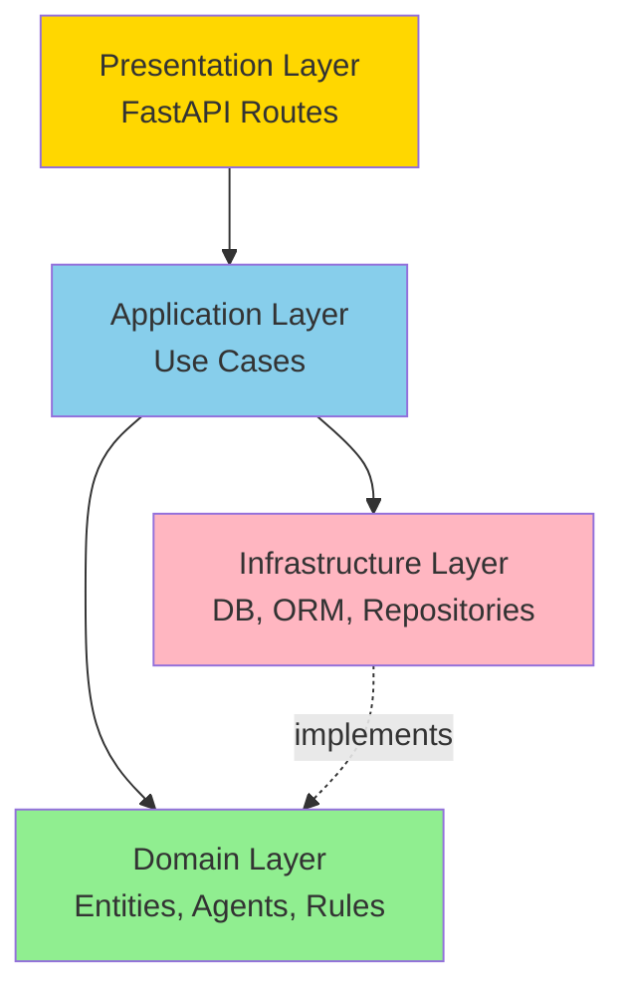

# 🚀 AI Decision Ecosystem Engine

A highly advanced, **Multi-Agent Decision Support System** built with **FastAPI, PostgreSQL (Async), and Clean Architecture**. It orchestrates a simulation where three virtual agents (CEO, CFO, HR) evaluate business scenarios, debate over multiple rounds, and reach a consensus using a blend of deterministic rules and LLM reasoning.


## 🤖 LLM-Augmented Agents (opt-in)

The CEO, CFO and HR agents can now be wrapped with an LLM that **enriches the
`reasoning` field** of each `AgentMessage` while leaving stance, confidence and
metrics fully deterministic. Round-2 prompts include the prior discussion, so
agents respond to each other semantically instead of via templated slots.

Activate at runtime:

```bash
export MADE_USE_LLM=1
# Windows PowerShell:
# $env:MADE_USE_LLM="1"
uvicorn app.main:app --reload
```

`AgentFactory.create_default_agents()` first applies any available calibrated
weights, then wraps the resulting agent with `LLMAgent`
(`app/domain/agents/llm_agent.py`) backed by `OllamaLLMClient`
(`app/infrastructure/llm_client.py`, default model `qwen2.5:14b`). Tests use a
deterministic `StubLLMClient`; if the Ollama endpoint is unreachable, the LLM
returns empty text, or the LLM reasoning contradicts the deterministic stance,
the agent falls back to its template reasoning — the system never errors out.

Try the before/after comparison:

```bash
python scripts/demo_llm_reasoning.py
```

The demo emits the same scenario's reasoning produced by (1) the base agents
and (2) the LLM-wrapped agents using a stub client, so you can see the
structural change without needing Ollama running.

Latest safeguards added in `feature/llm-agent-integration`:

- **Clean Architecture port:** `LLMClient` and `LLMUnavailableError` live in
  `app/domain/agents/llm_port.py`; concrete clients stay in infrastructure.
- **Contradiction fallback:** if LLM text contradicts the deterministic stance
  (`support`, `neutral`, `oppose`), the LLM output is discarded and the original
  base-agent message is returned.
- **Safe composition order:** runtime agents are composed as
  `base agent -> calibrated agent -> LLM agent`, so calibrated deterministic
  decisions happen before LLM reasoning enrichment.
- **Output cleanup:** markdown fences, headings, bullet markers and simple
  `"reasoning": "..."` wrappers are stripped before reasoning is accepted.
- **Regression coverage:** `tests/test_llm_agent.py` and
  `tests/test_llm_agent_factory.py` cover fallback, prompt context, sanitizing,
  and calibration-before-LLM composition.

## 📌 Features
- **Multi-Agent Debate Protocol:** 3 specialized agents (CEO, CFO, HR) reading each other's inputs in a round-based negotiation.
- **Hybrid AI Engine:** Deterministic rule-based scoring (for strict boundaries) backed by **Ollama (`qwen2.5:14b`)** for natural language reasoning and insight.
- **Fully Asynchronous:** End-to-end `async/await` implementation via `asyncpg` and Async SQLAlchemy.
- **LLM Call Logging:** Built-in performance tracking for LLM token latencies, model fallbacks, and success rates.
- **Robust Testing:** 80+ Pytest cases executed in `<2s` ensuring flawless core logic.

## 🛠️ Technology Stack
- **Backend:** FastAPI, Pydantic v2
- **Database:** PostgreSQL, SQLAlchemy (Async), Alembic, `asyncpg`
- **AI / LLM:** Ollama (Local LLM instance), LangChain
- **DevOps:** Docker Compose, Pytest
- **Upcoming (Sprint 3):** Scikit-Learn (ML Orchestrator), Streamlit (Frontend Dashboard)

## 🚀 Quick Start (Local Setup)

1. **Clone the repository and create a virtual environment:**
   ```bash
   git clone https://github.com/multi-agent-decision-engine/core-engine.git
   cd core-engine
   python -m venv .venv
   # Windows: .venv\Scripts\activate | macOS/Linux: source .venv/bin/activate
   ```

2. **Install dependencies:**
   ```bash
   pip install -r requirements.txt
   ```

3. **Environment Variables:**
   Copy `.env.example` to `.env` (or configure via OS). 
   *(Note: Alembic uses `postgresql+psycopg2` for migrations, while the app uses `postgresql+asyncpg` internally.)*

4. **Start Database and Apply Migrations:**
   ```bash
   docker compose up -d db
   alembic upgrade head
   ```

5. **Start API:**
   ```bash
   uvicorn app.main:app --reload
   ```

*(Alternatively, you can just run `docker compose up --build` for a fully containerized startup).*

## 🧪 Testing
The core engine is covered by a robust test suite testing boundary conditions, agent behaviors, and schema validations.
```bash
pytest tests/ -v
```

## Run with Docker
1. Build and start services:
   ```bash
   docker compose up --build
   ```
2. Apply migrations inside the app container:
   ```bash
   docker compose exec app alembic upgrade head
   ```
3. Access API:
   ```
   http://localhost:8000/docs
   ```

## One-command startup helpers
- Linux/macOS:
   ```bash
   make start
   ```
- Windows (PowerShell):
   ```powershell
   .\start.ps1
   ```

## One-command stop helpers
- Linux/macOS:
   ```bash
   make stop
   ```
- Windows (PowerShell):
   ```powershell
   .\stop.ps1
   ```

## Demo & Submission

**For a quick walkthrough:** See [`docs/demo.md`](docs/demo.md) for a 3-minute demo script with exact commands to create, simulate, and retrieve scenarios.

**For submission requirements:** See [`docs/submission.md`](docs/submission.md) for the complete checklist (environment, migrations, tests, CI, repo structure).

## API Endpoints
- `POST /api/v1/scenarios` - Create scenario
- `POST /api/v1/scenarios/{id}/simulate` - Run round-based agent simulation and persist outputs + final decision
- `GET /api/v1/scenarios?limit=20&offset=0` - List scenarios (paginated)
- `GET /api/v1/scenarios/{id}` - Get scenario details
- `GET /api/v1/scenarios/{id}/simulation` - Get scenario with agent outputs and final decision

Detailed simulation response contract:

- `rounds` - CEO, CFO and HR messages grouped by discussion round
- `total_rounds` - number of rounds executed
- `consensus_reached` - whether all agents reached the same stance
- `stability_reached` - whether agent positions stabilized between rounds
- `agent_outputs` - final legacy agent scores and rationales
- `final_score` / `final_decision` - aggregated recommendation
- `scenario_type`, `scenario_type_confidence`, `agent_weights` - classifier-driven context

See [`docs/backend_simulation_contract.md`](docs/backend_simulation_contract.md) for the frontend/backend response contract.

Minimal response shape:

```json
{
  "scenario_id": 5,
  "rounds": [{"round_number": 1, "messages": [{"agent": "CEO", "stance": "neutral", "confidence": 0.6}]}],
  "total_rounds": 2,
  "final_score": 46.0,
  "final_decision": "REJECT",
  "scenario_type": "team_expansion",
  "agent_weights": {"CEO": 0.25, "CFO": 0.25, "HR": 0.5}
}
```

## Scenario Input Contract

All agents (CEO, CFO, HR) analyze the same standardized scenario input:

```json
{
  "name": "Market Expansion Initiative",
  "description": "Expand into Southeast Asia market",
  "budget_million_usd": 5.0,
  "expected_roi_percent": 45.0,
  "risk_level": 6,
  "team_readiness": 7
}
```

**Field Ranges & Meanings:**
- `budget_million_usd` (float, > 0): Investment cost in millions
- `expected_roi_percent` (float): Expected return % (positive or negative)
- `risk_level` (int, 1–10): Project risk level (1=low, 10=high)
- `team_readiness` (int, 1–10): Team capability (1=unready, 10=expert)

**Agent Scoring:**
- **CEO**: Strategic fit (ROI) × Market confidence (1 - risk) → 0–100
- **CFO**: Financial ROI × Risk penalty (1 - risk_factor) → 0–100
- **HR**: Team readiness × Hiring load factor × Time factor → 0–100

**Decision Thresholds:**
- Average score ≥ 75: **APPROVE**
- Average score 50–74: **REVISE**
- Average score < 50: **REJECT**

## Quick Start Demo

After starting the API (`http://localhost:8000`):

### 1. Create a Scenario
```bash
curl -X POST http://localhost:8000/api/v1/scenarios \
  -H "Content-Type: application/json" \
  -d '{
    "name": "Market Expansion",
    "description": "Southeast Asia entry",
    "budget_million_usd": 5.0,
    "expected_roi_percent": 45.0,
    "risk_level": 6,
    "team_readiness": 7
  }'
# Returns: {"scenario_id": 1}
```

### 2. Run Simulation
```bash
curl -X POST http://localhost:8000/api/v1/scenarios/1/simulate
# Returns agent scores (CEO, CFO, HR) + final decision (APPROVE/REVISE/REJECT)
```

### 3. Retrieve Results
```bash
# Get all scenarios
curl http://localhost:8000/api/v1/scenarios?limit=10

# Get scenario details
curl http://localhost:8000/api/v1/scenarios/1

# Get full simulation with agent outputs
curl http://localhost:8000/api/v1/scenarios/1/simulation
```

### Python Example
```python
import requests

base_url = "http://localhost:8000/api/v1"

# Create scenario
scenario_response = requests.post(
    f"{base_url}/scenarios",
    json={
        "name": "Product Launch",
        "description": "New product launch Q2",
        "budget_million_usd": 2.5,
        "expected_roi_percent": 30.0,
        "risk_level": 4,
        "team_readiness": 8,
    }
)
scenario_id = scenario_response.json()["scenario_id"]

# Run simulation
simulation = requests.post(f"{base_url}/scenarios/{scenario_id}/simulate").json()
print(f"Decision: {simulation['final_decision']} (score: {simulation['final_score']})")

# Retrieve results
results = requests.get(f"{base_url}/scenarios/{scenario_id}/simulation").json()
for output in results["agent_outputs"]:
    print(f"{output['agent_name']}: {output['score']} - {output['rationale']}")
```

## Architecture & Patterns

### Clean Architecture (Layered)

This project implements **Clean Architecture** with strict dependency rules to ensure maintainability, testability, and separation of concerns.



### Layer Responsibilities

| Layer | Responsibility | Dependencies |
|-------|---------------|--------------|
| **Domain** | Business entities, agent logic, interfaces | None (pure domain) |
| **Application** | Use cases, orchestration | Domain only |
| **Infrastructure** | Database, ORM, repositories | Domain (implements interfaces) |
| **Presentation** | API routes, request/response schemas | Application + Domain |

**Key Rules:**
- Domain has **no external dependencies**
- Infrastructure implements domain repository interfaces
- Application orchestrates domain + infrastructure
- Presentation remains thin (no business logic)

### Design Patterns

| Pattern | Usage | Location |
|---------|-------|----------|
| **Repository Pattern** | All database operations abstracted | `domain/repositories.py` (contracts)<br/>`infrastructure/repositories/` (implementations) |
| **Factory Pattern** | Agent instantiation | `domain/agents/factory.py` |
| **Dependency Injection** | Service/repository wiring | `presentation/dependencies.py` |
| **Strategy Pattern** | Agent analysis interface | `domain/agents/base.py` (Agent ABC) |

### Testing Strategy

- **Unit Tests**: Domain logic (agents, aggregator, services with mocked repositories)
- **Integration Tests**: API endpoints with dependency overrides (FastAPI TestClient)
- **Coverage**: CFO/HR scoring rules, decision aggregation, pagination, 404 cases

**CI**: GitHub Actions runs `pytest` on every pull request.

### Data Flow Example

```
POST /api/v1/scenarios/{id}/simulate
  ↓
Route Handler (presentation)
  ↓
ScenarioSimulationService (application)
  ↓
AgentFactory.create_default_agents() (domain)
  → CEO/CFO/HR agents analyze scenario
  ↓
DecisionAggregator (domain)
  ↓
Repository.create() (infrastructure → PostgreSQL via ORM)
  ↓
SimulationResponse (presentation)
```

## Project Management (Kanban)

This project was managed using **Jira Kanban** with a structured workflow and code review process. For detailed documentation, see [`docs/workflow.md`](docs/workflow.md).

### Task → Branch → PR → Review Cycle

1. **Task Created** in Jira (e.g., `JIRA-42`)
2. **Branch Created** from main: `feature/JIRA-42-short-description`
3. **Development** locally or on branch
4. **Push & Create Pull Request** with reference to Jira task
5. **Code Review**: Verify clean architecture, tests pass, no raw SQL
6. **Approval & Merge** to main
7. **CI Pipeline**: GitHub Actions runs full test suite

**Workflow Stages**:
```
📋 To Do → 🔨 In Progress → 👀 Code Review → ✅ Done
```

**Branch Naming**: `feature/JIRA-XX-short-description`

**PR Requirements**:
- Linked Jira task in description
- All CI checks passing
- At least 1 code review approval
- No architecture violations (clean layers maintained)
